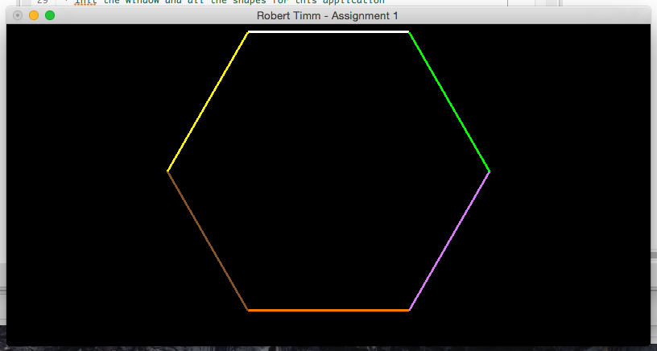

## CSCE-441-Project-1 An intro to Glut

### Compile & Run
* Navigate to this repo.
* Type `make`
* Run with `./main`

### Guidelines
In the window draw a hexagon (outline only, not filled).  The sides of the hexagon should be white, green, purple, orange, brown, and yellow, not necessarily in that order.  The hexagon should be approximately in the middle of the window, and should be regular (sides same length, and angles the same).  The background should be black.

